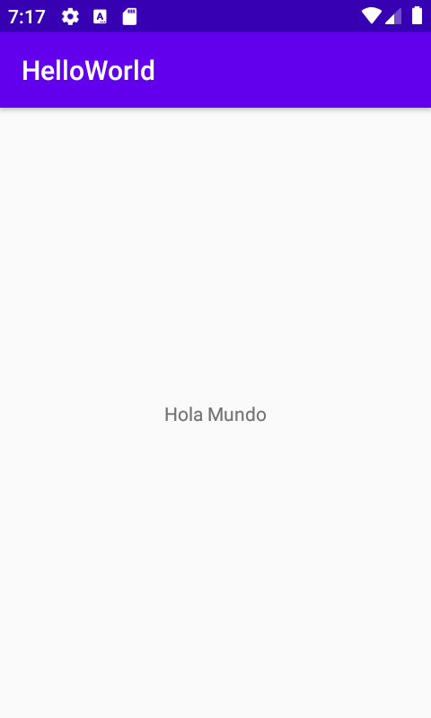
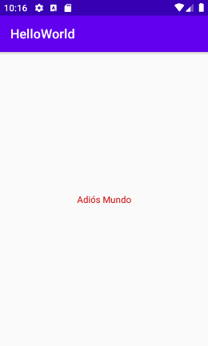

# AEA01_Sergio_RuizMontilla

## Proyecto Hello World

#### Descripción del Proyecto

- Creación de una aplicación como toma de contacto con la asignatura de DEINT.

- Contiene un Activity con un botón, cuya función es mostrar un mensaje ("Hola Mundo").

  

  - También hemos programado para que en tiempo de ejecución cambie el contenido del TextView donde ponía Hola Mundo ahora pone Adiós Mundo y modifique el color del contenido del TextView...

    

- Plataforma: Java.

- MinSDKVersion: 23.

- TargetSDKVersion: 28.

- CompileSDKVersion: 29.

- Hay 2 layout dependiendo de la posición del dispositivo móvil (si es horizontal o vertical).

- Tiene la opción de ser una aplicación bilingüe, dependiendo del idioma que se haya escogido en el dispositivo, se presenta en español o inglés.

- Dispone de un icono personalizado.

  

  

  

#### Comandos GitHub Utilizados

git init.

git remote add origin https://github.com/sergio-rm13/HelloWorld.git

git add .

git commit -m "Proyecto HelloWorld"

git push origin master